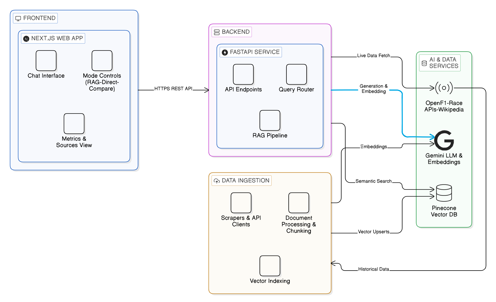

# F1 RAG Assistant

A domain-specific question-answering system for Formula 1, built around a hybrid RAG architecture. Answers are grounded in a curated knowledge base (Wikipedia, historical race data) with real-time augmentation from the OpenF1 API. The UI exposes three response modes — RAG, Direct, and Compare, so you can see exactly what retrieval adds.

Deployed with a cloud-native architecture:

* **Frontend:** Vercel
* **Backend:** Heroku

**Live Demo:**
[https://race-analytics.vercel.app/](https://race-analytics.vercel.app/)

**Note for First-Time Access (Important):**
The backend is hosted on Heroku dyno, which may enter a sleep state after periods of inactivity. The first request can take **30–60 seconds** to respond while the server wakes up. Subsequent requests will be fast.

---

## Architecture



---

## How It Works

**At ingestion time** — F1 content from Wikipedia and the Jolpica/Ergast API is scraped, chunked into 800-character segments with 200-character overlap, and embedded using `gemini-embedding-001` (768 dimensions). Vectors are upserted into Pinecone under separate namespaces per data source (`wikipedia`, `ergast-results`, `ergast-drivers`, `ergast-constructors`, `ergast-circuits`).

**At query time** — the user's question is embedded with `task_type="retrieval_query"` and used to search Pinecone. The top-k most similar chunks (above a 0.70 cosine threshold) are injected into a structured prompt alongside the question. Gemini 2.5 Flash generates a grounded answer, constrained to only use the retrieved context. If the query is detected as live (keywords like "current position", "right now", "track temperature"), the OpenF1 API is called first to augment the context with real-time session data.

---

## Response Modes

| Mode | Behaviour |
|------|-----------|
| **RAG** | Retrieves from Pinecone, grounds answer in sourced context with citations |
| **Direct** | Pure LLM response, no retrieval — useful for general F1 knowledge |
| **Compare** | Runs both in parallel, side-by-side — shows what retrieval actually adds |

Every response surfaces retrieval latency, generation latency, documents retrieved, and average similarity score.

---

## Tech Stack

| Layer | Technology |
|-------|-----------|
| Frontend | Next.js 16 · TypeScript · Tailwind CSS 4 · shadcn/ui |
| Backend | FastAPI · Pydantic Settings · Loguru · Uvicorn |
| Vector DB | Pinecone Serverless (cosine, 768d, namespaced) |
| LLM | Google Gemini 2.5 Flash |
| Embeddings | `gemini-embedding-001` (768d, task-aware) |
| Scraping | Trafilatura + BeautifulSoup fallback |
| Historical Data | Jolpica / Ergast REST API |
| Live Data | OpenF1 API (real-time session augmentation) |
| Deployment | Heroku (backend Docker) · Vercel (frontend) |

---

## Project Structure

```
f1-rag-chatbot/
├── backend/
│   ├── main.py                    # FastAPI app factory + CORS + lifespan
│   ├── Dockerfile                 # Multi-stage container (Heroku-compatible)
│   ├── Procfile / heroku.yml      # Heroku deployment config
│   ├── .env.example               # Environment variable template
│   └── app/
│       ├── api/routes.py          # Endpoints: /chat /compare /status /evaluate
│       ├── core/config.py         # Pydantic-settings (env-driven)
│       ├── evaluation/evaluator.py # Keyword-scoring RAG evaluation
│       ├── ingestion/             # Chunker, Wikipedia scraper, Ergast client, pipeline
│       ├── models/schemas.py      # Pydantic request/response contracts
│       ├── retrieval/             # RAG chain, live data router (OpenF1)
│       └── services/              # Embedding, LLM, vector store providers (ABC pattern)
├── frontend/
│   ├── src/app/page.tsx           # State orchestration
│   ├── src/components/chat/       # MessageList, MetricsBar, SourcePanel
│   ├── src/components/sidebar/    # Mode selector, top-k, namespace filter
│   └── src/lib/                   # API client, TypeScript types
├── docs/
│   └── architecture.md            # Architecture diagram source
└── README.md
```

---

## Quick Start

### Prerequisites

- Python 3.11+
- Node.js 18+
- [Google AI Studio](https://aistudio.google.com/app/apikey) API key
- [Pinecone](https://www.pinecone.io/) API key + index

### Backend

```bash
cd backend
cp .env.example .env
# Fill in GOOGLE_API_KEY, PINECONE_API_KEY, PINECONE_INDEX_NAME

pip install -r requirements.txt
uvicorn main:app --reload --port 8000
```

### Frontend

```bash
cd frontend
npm install
cp .env.example .env.local
# Set NEXT_PUBLIC_API_URL=http://localhost:8000

npm run dev
```

### Ingest Data (run once locally)

```bash
# From backend/ with venv activated
python -c "from app.ingestion.pipeline import ingest_all; ingest_all()"
```

---
The backend ingestion endpoint is disabled (`HTTP 403`) in production. The knowledge base is populated offline and persisted in Pinecone.

